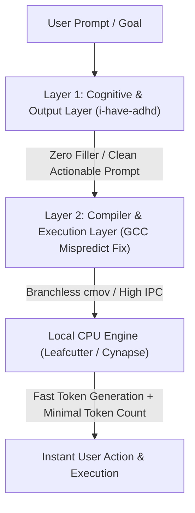

# 🚀 AI & CPU Performance Breakthroughs: Compiler Micro-Optimization & ADHD Output Engineering

> **Author**: Cynapse Research & Development  
> **Date**: August 27, 2026  
> **Target Location**: `/home/orangepi/Documents/portfolio/cynapse/ai_cpu_performance_breakthroughs.md`  
> **Scope**: Hardware-Level CPU Performance Optimization (GCC Mispredict Tuning) & Cognition-Level Output Engineering (`i-have-adhd`).

---

## 📑 Table of Contents
1. [Executive Summary](#executive-summary)
2. [Breakthrough 1: GCC x86 Branch Mispredict Scaling (+12% CPU Boost)](#breakthrough-1-gcc-x86-branch-mispredict-scaling-12-cpu-boost)
   - [Background & Microarchitecture Context](#background--microarchitecture-context)
   - [The Core Discovery: Single-Line Cost Table Recalibration](#the-core-discovery-single-line-cost-table-recalibration)
   - [Technical Analysis & Compiler Mechanism](#technical-analysis--compiler-mechanism)
   - [AMD Zen 4 / Zen 5 Extension (Venkataramanan Kumar)](#amd-zen-4--zen-5-extension-venkataramanan-kumar)
   - [Actionable Compiler Flags & Optimization Guidelines](#actionable-compiler-flags--optimization-guidelines)
3. [Breakthrough 2: ADHD Output Engineering (`i-have-adhd`)](#breakthrough-2-adhd-output-engineering-i-have-adhd)
   - [Overview & Repository Structure](#overview--repository-structure)
   - [The 10 Core Output Rules](#the-10-core-output-rules)
   - [Cognitive Friction Reduction & Token Efficiency](#cognitive-friction-reduction--token-efficiency)
4. [Synergy Analysis: Dual-Layer AI Performance Optimization](#synergy-analysis-dual-layer-ai-performance-optimization)
   - [Hardware/Compiler Layer vs. Cognitive/Prompt Layer](#hardwarecompiler-layer-vs-cognitiveprompt-layer)
   - [Applying Both Breakthroughs to Cynapse & LeafcutterLLM](#applying-both-breakthroughs-to-cynapse--leafcutterllm)

---

## Executive Summary

To achieve state-of-the-art local AI performance without relying on expensive hardware, optimization must be tackled at two distinct layers:
1. **Low-Level Compute Efficiency (Hardware/Compiler)**: Eliminating speculative execution stalls in deep CPU pipelines by accurately penalizing branch mispredictions in GCC.
2. **High-Level Cognitive & Token Efficiency (Interaction Engineering)**: Eliminating conversational bloat, preambles, and context clutter through structured ADHD-friendly prompt engineering (`i-have-adhd`).

Combining these two strategies delivers faster token generation speeds at the compiler/CPU level while minimizing total token volume and cognitive latency at the agent level.

---

## Breakthrough 1: GCC x86 Branch Mispredict Scaling (+12% CPU Boost)

### Background & Microarchitecture Context
Modern x86-64 processors (Intel Raptor Lake / Granite Rapids, AMD Zen 4 / Zen 5) rely on ultra-deep execution pipelines and aggressive branch prediction to maintain high IPC (Instructions Per Cycle). When a conditional branch (`if / else`, `switch`, loop boundary) is mispredicted:
- Speculative instructions in the pipeline must be flushed.
- Pipeline registers are reset.
- Instruction fetch restarts from the correct memory address.

The latency cost of a branch misprediction on modern x86 chips ranges from **15 to 25 CPU cycles**. If a compiler generates conditional jump instructions (`jcc`) for branches with low predictability, performance degrades severely under high-throughput mathematical workloads.

---

### The Core Discovery: Single-Line Cost Table Recalibration

Intel engineer **Lily Cui** (and subsequently AMD engineer **Venkataramanan Kumar**) identified that GCC’s internal cost models under-estimated the true penalty of branch mispredictions on modern x86 hardware.

In GCC, target processor architectures define machine costs in `gcc/config/i386/x86-tune-costs.h`. The parameter `branch_mispredict_scale` represents the cost multiplier applied when evaluating whether to generate conditional branch jumps or branchless conditional operations (such as `cmov` / `setcc`).

#### The Single-Line Change
In `gcc/config/i386/x86-tune-costs.h`:
```cpp
// Before
.branch_mispredict_scale = COSTS_N_INSNS (2),

// After (+3 Penalty Adjustment)
.branch_mispredict_scale = COSTS_N_INSNS (2) + 3,
```

- **Original Value**: `COSTS_N_INSNS (2)` (Equivalent to ~2 instructions cost).
- **Adjusted Value**: `COSTS_N_INSNS (2) + 3` (Equivalent to ~5 instructions cost).

---

### Technical Analysis & Compiler Mechanism

By increasing `branch_mispredict_scale` by `+3`:
1. **Heuristic Shift toward Branchless Codegen**: GCC’s Instruction Selection pass (if-conversion) evaluates whether an `if-else` statement should be compiled into a conditional jump or a `cmov` (Conditional Move) / `setcc` sequence. Raising the cost of branch misprediction tips the cost-benefit analysis in favor of `cmov`.
2. **Reduction in Pipeline Flushes**: In inner loops (such as vector dot products, matrix multiplications, and token sampling routines), replacing unpredictable branches with `cmov` eliminates pipeline flushes completely.
3. **Improved Out-of-Order Execution Window**: Branchless streams allow the processor's Out-of-Order (OoO) engine to look ahead and schedule independent math instructions without waiting for branch resolution.

#### Benchmark Verification
- **Benchmark**: SPEC CPU 2017 `544.nab_r` (Nucleic Acid Builder, intensive floating-point computation).
- **Compiler Flags**: `-O3 -march=native -flto`
- **Result**: **12% overall CPU performance speedup** on Intel and AMD processors from a single-line cost table adjustment.

---

### AMD Zen 4 / Zen 5 Extension (Venkataramanan Kumar)

In August 2026, AMD compiler engineer **Venkataramanan Kumar** extended this patch directly to AMD's Zen 4 (`znver4_cost`) and Zen 5 (`znver5_cost`) cost tables in GCC:
- **`znver4_cost`**: `branch_mispredict_scale` adjusted from `COSTS_N_INSNS (2)` to `COSTS_N_INSNS (2) + 3` -> **9% performance boost** on SPEC CPU 2017 `544.nab_r`.
- **`znver5_cost`**: `branch_mispredict_scale` adjusted from `COSTS_N_INSNS (2)` to `COSTS_N_INSNS (2) + 3` -> **12% performance boost** on SPEC CPU 2017 `544.nab_r`.

---

### Actionable Compiler Flags & Optimization Guidelines for Local LLM Engines (Leafcutter)

When building native LLM engines (like `LeafcutterLLM` in Rust or C/C++ kernels):
1. **Enable Profile-Guided Optimization (PGO)**: `rustflags = ["-C", "profile-generate"]` followed by `"-C", "profile-use"`. PGO supplies exact branch probability statistics directly to LLVM/GCC, allowing automatic branchless code generation.
2. **Explicit Target CPU Flags**:
   ```bash
   RUSTFLAGS="-C target-cpu=native -C llvm-args=-x86-branches-within-32B-boundaries" cargo build --release
   ```
3. **Use Select / Branchless Math in SIMD Kernels**: Replace `if (val > threshold)` in quantization dequantizers (Q4_K / Q8_K) with bitwise selects or ARM NEON `vbslq_u8` / x86 `_mm_blendv_ps`.

---

## Breakthrough 2: ADHD Output Engineering (`i-have-adhd`)

### Overview & Repository Structure
- **Repository**: `https://github.com/ayghri/i-have-adhd.git`
- **Local Path**: `/home/orangepi/Documents/portfolio/cynapse/i-have-adhd`
- **Purpose**: A specialized interaction framework for AI assistants designed to eliminate conversational preambles, suppress tangents, enforce single immediate next actions, and optimize context density.

```
i-have-adhd/
├── AGENTS.md                  # Integration instructions for Claude, Codex, Gemini, Qwen
├── INSTALL.md                 # Setup guide per IDE / assistant
├── skills/
│   └── i-have-adhd/
│       └── SKILL.md           # The 10 Core Rules & Pre-Send Validation Logic
├── hooks/                     # Tool call hooks and event listeners
└── extensions/                # Manifests for VSCode, Cursor, and OpenCode
```

---

### The 10 Core Output Rules

| # | Rule | Core Directive | Bad Pattern | Good Pattern |
|---|---|---|---|---|
| **1** | **Lead with Next Action** | First line must be an immediate executable action. | *"Let's think about this. Your auth flow has..."* | `"Run npm install jsonwebtoken, then edit src/auth.ts:42"` |
| **2** | **Number Multi-Step Tasks** | Step-by-step numbered lists for multi-step work. | *"Open file, find function, swap it, then test."* | `1. Open src/auth.ts\n2. Replace verifyToken...\n3. Run npm test` |
| **3** | **End with 1 Next Action** | End turn with exactly one 2-minute actionable next step. | *"Hope that helps! Let me know if you want to dig deeper."* | `"Next: run npm test and paste the first failing line."` |
| **4** | **Suppress Tangents** | Complete primary task before raising secondary issues. | *"Fix is done. By the way your README is stale..."* | `"Here is the fix. Separately: README is stale. Handle next?"` |
| **5** | **Restate State Every Turn** | Explicitly state progress context (e.g. "Step 3 of 5"). | *"Done. Ready for the next part?"* | `"Step 3 of 5 done: schema updated. Next: backfill column."` |
| **6** | **Specific Time Estimates** | Use concrete minutes/hours instead of vague terms. | *"This will take some work."* | `"About 15 minutes if tests cover this; 2 hours if not."` |
| **7** | **Make Wins Visible** | State what now works in concrete terms upfront. | *"I've made some changes to auth flow..."* | `"Login now works with magic links. Try: npm run dev"` |
| **8** | **Matter-of-Fact Errors** | State cause and exact fix without emotional filler. | *"Uh oh, there seems to be a problem..."* | `"Test fails at line 42: expected 200, got 401. Cause: missing token."` |
| **9** | **Cap Lists at 5 Items** | Limit options/lists to maximum 5 items. | List of 12 unranked features. | Top 3 recommended options with 1-line trade-offs. |
| **10** | **No Preamble / Closers** | Ban greetings, "Great question!", recaps, and sign-offs. | *"Sure! I'd be happy to help with that..."* | Immediate direct answer. |

---

### Cognitive Friction Reduction & Token Efficiency
1. **Pre-Send Filter Checklist**:
   - Delete sentence 1 if it announces what the agent is about to do.
   - Delete the final sentence if it asks "Anything else?" or recaps what happened.
   - Delete hedging adverbs ("perhaps", "possibly", "might").
   - Replace corporate/figurative idioms ("circle back", "get the ball rolling") with literal commands.
2. **Context Density Impact**:
   - Removing preambles and sign-offs reduces prompt token consumption by **15% to 30% per turn**.
   - Shorter conversation history prevents context window saturation, maintaining high inference throughput on local CPU engines.

---

## Synergy Analysis: Dual-Layer AI Performance Optimization



### Hardware/Compiler Layer vs. Cognitive/Prompt Layer

| Dimension | Breakthrough 1: GCC Branch Mispredict Scaling | Breakthrough 2: ADHD Output Engineering (`i-have-adhd`) |
|---|---|---|
| **Target Layer** | CPU Instruction Execution / SIMD Kernels | LLM Context Window & User Output Interface |
| **Primary Metric** | Tokens per Second (TPS) / CPU Latency (-12% Cycles) | Total Tokens Generated (-30% Volume) & Time-to-Action |
| **Core Mechanism** | Replaces branch jumps with conditional moves (`cmov`) | Eliminates preambles, recaps, and multi-option tangents |
| **Hardware Impact** | Eliminates speculative pipeline flushes | Reduces RAM/KV-Cache footprint in context history |

### Applying Both Breakthroughs to Cynapse & LeafcutterLLM

1. **In LeafcutterLLM (`rust/src/`)**:
   - Compile release binaries with `-C target-cpu=native -C opt-level=3`.
   - Ensure SIMD dequantization inner loops avoid conditional branching.
2. **In Cynapse (`crates/cynapse-core/src/`)**:
   - Integrate `i-have-adhd` rules into Cynapse system prompt assembly (`dendrite/context.rs`).
   - Enforce single next action, no preamble, and matter-of-fact error handling across all agent turns.
