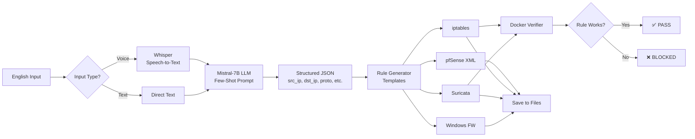

# AI Firewall Rule-Miner (MVP)


**"Speak English, get pfSense rules, verify them offline"**

Convert natural language to firewall rules for multiple platforms using local AI models. No cloud, no API calls, completely offline.

## 🎯 What It Does

AI Firewall Rule-Miner takes English descriptions (voice or text) and generates ready-to-deploy firewall rules for:
- **pfSense** (XML configuration)
- **iptables** (Linux firewall)
- **Suricata** (IDS/IPS rules)
- **Windows Advanced Firewall** (PowerShell commands)

Each generated rule is verified in an ephemeral Docker container to ensure it works as intended.

## ✨ Key Features

- 🎤 **Voice or Text Input** - Speak your rules or type them
- 🤖 **Local AI Processing** - Uses Mistral-7B (quantized) for parsing, runs on CPU
- 🔒 **Completely Offline** - No internet required, no API calls
- 🐳 **Auto-Verification** - Tests rules in Docker containers (iptables, Suricata)
- 📝 **Multi-Platform** - Generates rules for 4 different firewall systems
- ⚡ **Fast** - Complete end-to-end in <10 seconds

## 📋 Table of Contents

- [Quick Start](#quick-start)
- [Installation](#installation)
  - [Prerequisites](#prerequisites)
  - [Model Setup](#model-setup)
  - [Dependencies](#dependencies)
- [Usage](#usage)
  - [Text Input](#text-input)
  - [Voice Input](#voice-input)
  - [Advanced Options](#advanced-options)
- [Architecture](#architecture)
  - [How It Works](#how-it-works)
  - [Code Structure](#code-structure)
- [Configuration](#configuration)
- [Examples](#examples)
- [Troubleshooting](#troubleshooting)
- [Limitations](#limitations)
- [Contributing](#contributing)
- [License](#license)

## 🚀 Quick Start

```bash
# Clone the repository
git clone https://github.com/Alartist40/AI-Firewall-Rule-Miner.git
cd AI-Firewall-Rule-Miner

# Install dependencies
pip install -r requirements.txt

# Download models (see Model Setup section)
# Place models in the models/ directory

# Run with text input
python rule_miner.py "Block SSH from 192.168.1.50 after 6 pm"

# Or use voice input
python rule_miner.py --voice
```

## 📦 Installation

### Prerequisites

1. **Python 3.8+** - [Download Python](https://www.python.org/downloads/)
2. **Docker** - [Install Docker](https://docs.docker.com/get-docker/) (required for rule verification)
3. **Git** - [Install Git](https://git-scm.com/)

**System Requirements:**
- **CPU**: 4+ cores (for LLM inference)
- **RAM**: 8 GB minimum (Mistral-7B-int4 needs ~6 GB)
- **Disk**: 5-6 GB free space (4 GB for model + code + containers)
- **Microphone**: Optional, for voice input

### Model Setup

This application requires two AI models:

#### 1. Mistral-7B-Instruct (Quantized to 4-bit)

**Download:**
```bash
# Create models directory
mkdir models

# Download from Hugging Face
# Option A: Using wget
wget https://huggingface.co/TheBloke/Mistral-7B-Instruct-v0.2-GGUF/resolve/main/mistral-7b-instruct-v0.2.Q4_K_M.gguf -O models/mistral7b_int4.gguf

# Option B: Using huggingface-cli
pip install huggingface-hub
huggingface-cli download TheBloke/Mistral-7B-Instruct-v0.2-GGUF mistral-7b-instruct-v0.2.Q4_K_M.gguf --local-dir models --local-dir-use-symlinks False
```

**Alternative models** (if the above doesn't work):
- Mistral-7B-Instruct-v0.1 (Q4_K_M) from TheBloke
- Any other GGUF format model compatible with llama.cpp

**Size**: ~4 GB

#### 2. Whisper (for Voice Input)

Whisper models are downloaded automatically by the `openai-whisper` library on first use. The default is "tiny" (39 MB).

**Available models:**
- `tiny` - 39 MB (default, fastest)
- `base` - 74 MB (better accuracy)
- `small` - 244 MB (good balance)
- `medium` - 769 MB (high accuracy)
- `large` - 1550 MB (best accuracy)

To change the model, edit `config.json`:
```json
{
  "voice": {
    "whisper_model": "base"
  }
}
```

### Dependencies

Install Python dependencies:

```bash
pip install -r requirements.txt
```

**Core Dependencies:**
- `llama-cpp-python` - Local LLM inference
- `openai-whisper` - Voice transcription
- `sounddevice` - Audio recording
- `soundfile` - Audio file handling
- `docker` - Container management

**Optional Installation:**

For faster LLM inference with GPU support:
```bash
# CUDA support (NVIDIA GPUs)
CMAKE_ARGS="-DLLAMA_CUBLAS=on" pip install llama-cpp-python --force-reinstall --no-cache-dir

# Metal support (Apple Silicon)
CMAKE_ARGS="-DLLAMA_METAL=on" pip install llama-cpp-python --force-reinstall --no-cache-dir
```

## 🎯 Usage

### Text Input

The simplest way to generate firewall rules:

```bash
python rule_miner.py "Block SSH from 192.168.1.50 after 6 pm"
```

**Output:**
- Generated rules for all 4 platforms
- JSON representation of the parsed rule
- Verification results (✅ PASS or ❌ BLOCKED)
- Files saved to `output/` directory

### Voice Input

Record a 5-second voice command:

```bash
python rule_miner.py --voice
```

You'll hear:
```
[*] Recording for 5 seconds...
[*] Speak now!
```

Speak your rule clearly, e.g., *"Block SSH from 192.168.1.50 after 6 pm"*

### Advanced Options

#### Generate for Specific Platforms Only

```bash
# Only iptables and Suricata
python rule_miner.py "Allow HTTP from 10.0.0.0/24" --platform iptables suricata
```

#### Skip Verification

Useful if Docker is not available or you want faster generation:

```bash
python rule_miner.py "Block RDP from any" --no-verify
```

#### Custom Output Directory

```bash
python rule_miner.py "Deny ICMP from 172.16.0.0/16" --output my_rules
```

#### Custom Configuration File

```bash
python rule_miner.py "Allow HTTPS from 203.0.113.45" --config my_config.json
```

### Full CLI Help

```bash
python rule_miner.py --help
```

## 🏗️ Architecture

### How It Works



**Step-by-Step Process:**

1. **Input Capture**
   - Voice: Records 5 seconds of audio → Whisper transcribes to text
   - Text: Directly uses provided string

2. **LLM Parsing**
   - Sends text to local Mistral-7B model with few-shot prompt
   - Extracts structured JSON with fields: `src_ip`, `dst_ip`, `proto`, `dst_port`, `action`, `time_start`, `time_end`, `platform`
   - Validates and normalizes the JSON

3. **Rule Generation**
   - For each platform, applies the JSON to platform-specific templates
   - Generates syntactically correct rules

4. **Verification** (optional)
   - Spins up ephemeral Docker containers
   - Applies the rule in a test environment
   - Sends probe packets to test behavior
   - Returns PASS/FAIL status
   - Destroys containers

5. **Output**
   - Saves rules to `output/` directory
   - Displays results to user

### Code Structure

```
AI-Firewall-Rule-Miner/
├── rule_miner.py           # Main CLI application, orchestrates flow
├── voice_handler.py        # Voice recording & Whisper transcription
├── llm_handler.py          # LLM integration with llama-cpp-python
├── rule_generator.py       # Platform-specific rule templates
├── verifier.py             # Docker-based rule verification
├── utils.py                # Logging, config, file I/O utilities
├── config.json             # Configuration (model paths, parameters)
├── requirements.txt        # Python dependencies
├── setup.py                # Package installation script
├── templates/              # Rule templates for each platform
│   ├── pfsense_template.xml
│   ├── iptables_template.sh
│   ├── suricata_template.rules
│   └── windows_advfirewall_template.ps1
├── examples/               # Example outputs and usage
│   └── example_output.md
├── test_cases.json         # Test cases for validation
├── models/                 # AI models (not in repo, download separately)
│   └── mistral7b_int4.gguf
└── output/                 # Generated rules (created at runtime)
```

**Module Descriptions:**

- **`rule_miner.py`** - Main application class that coordinates all operations
- **`voice_handler.py`** - Handles audio recording via `sounddevice` and transcription via Whisper
- **`llm_handler.py`** - Manages LLM loading, prompt engineering, and JSON extraction
- **`rule_generator.py`** - Contains template logic for generating platform-specific rules
- **`verifier.py`** - Manages Docker containers for testing rules (iptables, Suricata)
- **`utils.py`** - Helper functions for configuration, logging, and file operations

## ⚙️ Configuration

Edit `config.json` to customize behavior:

```json
{
  "llm": {
    "model_path": "models/mistral7b_int4.gguf",
    "temperature": 0.1,
    "max_tokens": 256,
    "n_ctx": 2048
  },
  "voice": {
    "duration": 5,
    "sample_rate": 16000,
    "whisper_model": "tiny"
  },
  "templates": {
    "directory": "templates"
  },
  "verifier": {
    "docker_timeout": 30
  }
}
```

**Configuration Options:**

- `llm.model_path` - Path to GGUF model file
- `llm.temperature` - LLM sampling temperature (0.0-1.0, lower = more deterministic)
- `llm.max_tokens` - Maximum tokens to generate
- `llm.n_ctx` - Context window size
- `voice.duration` - Recording duration in seconds
- `voice.sample_rate` - Audio sample rate (16000 Hz recommended for Whisper)
- `voice.whisper_model` - Whisper model size (tiny, base, small, medium, large)
- `verifier.docker_timeout` - Timeout for Docker operations in seconds

## 📚 Examples

See [`examples/example_output.md`](examples/example_output.md) for detailed examples.

### Example 1: Block SSH After Hours

**Input:**
```bash
python rule_miner.py "Block SSH from 192.168.1.50 after 6 pm"
```

**Generated iptables Rule:**
```bash
iptables -A INPUT -s 192.168.1.50 -p tcp --dport 22 -m time --timestart 18:00 --timestop 23:59 -j DROP -m comment --comment 'Auto-generated by AI Firewall Rule-Miner'
```

### Example 2: Allow HTTP from Subnet

**Input:**
```bash
python rule_miner.py "Allow HTTP from 10.0.0.0/24"
```

**Generated pfSense Rule:**
```xml
<rule>
  <type>pass</type>
  <interface>wan</interface>
  <ipprotocol>inet</ipprotocol>
  <protocol>tcp</protocol>
  <source>
    <network>10.0.0.0/24</network>
  </source>
  <destination>
    <any/>
    <port>80</port>
  </destination>
  <descr>Auto-generated by AI Firewall Rule-Miner</descr>
</rule>
```

### Example 3: Block RDP Overnight

**Input:**
```bash
python rule_miner.py "Block RDP from any between 9 pm and 6 am"
```

**Verification Output:**
```
[*] Verifying iptables rule in Docker...
[+] iptables rule applied successfully
[+] Rule verified in iptables list
iptables: ✅ PASS
```

## 🔧 Troubleshooting

### Common Issues

#### 1. Model Not Found Error

**Error:**
```
FileNotFoundError: Model file not found: models/mistral7b_int4.gguf
```

**Solution:**
- Download the Mistral model (see [Model Setup](#model-setup))
- Ensure the file is in the `models/` directory
- Update `config.json` with the correct path

#### 2. Docker Not Running

**Error:**
```
[!] Docker not found or not responding
```

**Solution:**
- Install Docker Desktop
- Start Docker daemon
- Verify with: `docker --version`
- Or use `--no-verify` flag to skip verification

#### 3. Voice Recording Fails

**Error:**
```
sounddevice or soundfile not installed
```

**Solution:**
```bash
pip install sounddevice soundfile
```

**Error (Linux):**
```
ALSA lib ... cannot open shared object file
```

**Solution (Ubuntu/Debian):**
```bash
sudo apt-get install portaudio19-dev python3-pyaudio
```

#### 4. LLM Inference Too Slow

**Issue:** Generation takes >30 seconds

**Solutions:**
- Use GPU acceleration (see [Dependencies](#dependencies))
- Use a smaller model (though 4-bit is already quite small)
- Reduce `n_ctx` in config.json
- Close other applications to free RAM

#### 5. Whisper Model Download Hangs

**Solution:**
```bash
# Pre-download Whisper model
python -c "import whisper; whisper.load_model('tiny')"
```

### Debug Mode

Enable verbose logging:

```python
# Edit rule_miner.py line ~17
logger = setup_logging(level="DEBUG")
```

Or set environment variable:
```bash
export PYTHONPATH=.
python rule_miner.py "..." 2>&1 | tee debug.log
```

## ⚠️ Limitations

### Current MVP Limitations

1. **pfSense Verification** - Not fully implemented due to pfSense container complexity
2. **Windows Verification** - Requires Windows containers, not yet implemented
3. **Time-Based Rules** - Windows Advanced Firewall doesn't natively support time-based rules
4. **Complex Rules** - Multi-condition rules (AND/OR logic) not yet supported
5. **LLM Accuracy** - May misparse complex or ambiguous English descriptions
6. **Voice Quality** - Whisper accuracy depends on microphone quality and environment noise

### Known Issues

- **Docker on Windows** - May require WSL2 backend
- **Large Models** - RAM usage can spike during LLM inference
- **Voice on Headless** - Requires audio input device

## 🤝 Contributing

Contributions are welcome! This is an MVP, and there's plenty of room for improvement.

**Ideas for Contribution:**
- Add more platforms (Cisco ASA, Fortinet, etc.)
- Improve LLM prompts for better accuracy
- Implement pfSense/Windows verification
- Add web UI
- Support for multi-rule batch processing
- Export to various formats (JSON, CSV, etc.)

**How to Contribute:**
1. Fork the repository
2. Create a feature branch (`git checkout -b feature/amazing-feature`)
3. Commit your changes (`git commit -m 'Add amazing feature'`)
4. Push to the branch (`git push origin feature/amazing-feature`)
5. Open a Pull Request

## 📄 License

This project is licensed under the MIT License - see the [LICENSE](LICENSE) file for details.

## 🙏 Acknowledgments

- **Mistral AI** - For the Mistral-7B model
- **OpenAI** - For Whisper
- **llama.cpp team** - For efficient CPU inference
- **TheBloke** - For quantized model distributions

## 📞 Contact

- **GitHub**: [@Alartist40](https://github.com/Alartist40)
- **Repository**: [AI-Firewall-Rule-Miner](https://github.com/Alartist40/AI-Firewall-Rule-Miner)

---

**Built for sysadmins who want to speak English, not firewall syntax.**

*"English → Firewall in 5 seconds"*
